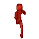

# Stick World

https://home-gamejam.github.io/stick-game/

## Pixel Art Render

### 64x64




### 128x128


## Dev

In world.gd, set `IS_WEB_RTC` to determine client / server or WebRTC

### Dev WebRTC

Run signaling server
./scripts/signal_server_ws.sh
./scripts/signal_server_udp.sh

Build or run the game

### Web Build + Html Server

> TODO: support for WebRTC over websockets

Build godot project + golang static file server
./scripts/build-web.sh [hostname]

Run the server
./build/[hostname].webserver

#### Web localhost

e.g. For local dev

```sh
./scripts/build-web.sh localhost
./build/localhost.webserver
```

#### Build Web and Deploy to Pi

NOTE: Be sure to update export file list if any files have been added

On pi:

```
sudo systemctl stop stickworldweb.service
```

Local:

```
GOOS=linux GOARCH=arm64 \
 ./scripts/build-web.sh pi44g.local && \
 ./scripts/cp-web.sh pi44g.local
```

On pi:

```
sudo systemctl start stickworldweb.service
```

#### Configure Systemd

1. Open a new config file for the service:

   ```sh
   sudo nano /etc/systemd/system/stickworldweb.service
   ```

1. Copy / paste the following template filling in <USER> and <APPDIR> placeholders

   ```ini
   [Unit]
   Description = Stick World - Web Server

   [Service]
   Type             = simple
   Restart          = always
   RestartSec       = 5s
   StandardOutput   = append:<APPDIR>/stdout.log
   StandardError    = append:<APPDIR>/stderr.log
   ExecStart        = <APPDIR>/signalserver
   WorkingDirectory = <APPDIR>
   User             = <USER>

   [Install]
   WantedBy = multi-user.target
   ```

1. Enable and start the service

```sh
sudo systemctl enable stickworldweb.service
sudo systemctl start stickworldweb.service
sudo systemctl status stickworldweb.service
```

### Build WS Signal Server to Pi

On Pi:
sudo systemctl stop gowebrtcsignal.service

Local:
./scripts/build-signal.sh pi44g.local

On Pi:
sudo systemctl start gowebrtcsignal.service

### Build iOS

Need to connect phone first
./scripts/build-ios.sh

### Build Pi

./scripts/build-pi.sh [pihostname]

## Multiplayer

- World scene has MultiplayerSpawner node. This watches a specific node for anything added and replicates it. Spawn path is set to World where players get added. Auto spawn list inclues Player scene.
- Player has a MultiplayerSynchronizer node that syncs position. Also calls set_multiplayer_authority in \_enter_tree() with its name / pid so that it only controls itself

## Blender

### Mixamo

I tried to use Mixamo with the idea I could easily apply different animations. Main challenge is that Blender uses a different naming convention for left / right than Blender, so armatures don't symetrize or mirror. There are addons to convert the naming convention, but this makes the armature incompatible with animations. Seems simpler to just use Rigify since it is supported by Blender more natively and just learn to create my own animations. If a compelling reason ever arises to support Mixamo animations, maybe there's a way to convert the animations to map to a Mixamo rig.
